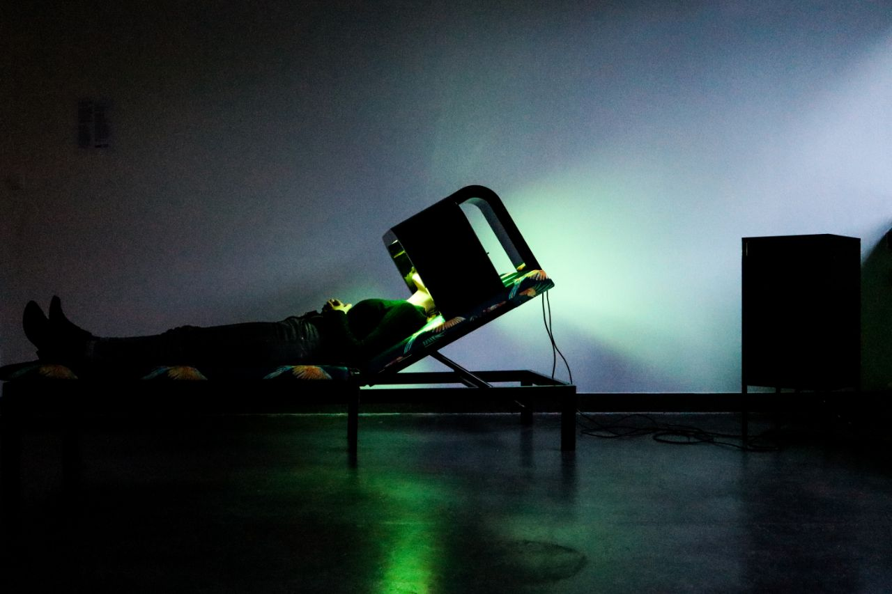

# chair // I am {emotion}

   

The code for the **'I am {emotion}'** art installation, by Manolis Perrakis
([@manorius](https://github.com/manorius)) and Mathis Antony
([@sveitser](https://github.com/sveitser)). More information about the art
installation can be found on our websites [artand.tech](https://artand.tech) and
[cogn.ai](https://cogn.ai).

   

## Warning

We're publishing this in case it may be of interest to anyone. The repository is
not extensively documented and you're likely to encounter issues if you try to
run it.

## Structure

The repo consists of checkouts of [GPT2](https://github.com/openai/gpt-2),
[Tacotron2](https://github.com/NVIDIA/tacotron2)
and an [emotion classifier](https://github.com/oarriaga/face_classification)
with some additions from our side (mainly a flask webserver for each model) as
well as a python client in the `client` directory that we ran on RaspberryPis.

## Setup

### Prerequisites

The `nix` package manager (version >= 2) and `direnv`. Make sure that direnv is
hooked into your shell correctly. Add the following line at the end of the `~/.bashrc` file:
```bash
eval "$(direnv hook bash)"
```
Or similarly for other shells.

Check out the repo
```
git clone https://github.com/sveitser/i-am-emotion
```

### Quick
Activate direnv
```
direnv allow
direnv allow emo
direnv allow gpt2
direnv allow tacotron2
direnv allow client
```
Run all APIs with
```
run-server
```

### Client

Install client on desktop
```
cd client
pip install -r requirements.txt
```
Install client on RPi
```
git clone --recursive https://github.com/sveitser/chair
cd chair
bash install-python-rpi
```
Run client with
```
cd client
python client.py
```

### Emotion prediction
#### Server
```
cd emo
python app.py
```

#### Client
```
curl -X POST -H 'Content-Type: multipart/form-data' -F "image=@PATH_OF_YOUR_IMAGE" http://localhost:4000
```

### Text generation
#### Server
The model files must be in `chair/gpt2/models/run2`. It should look like
```
  run2
    ├── checkpoint
    ├── counter
    ├── encoder.json
    ├── hparams.json
    ├── model-28000.data-00000-of-00001
    ├── model-28000.index
    ├── model-28000.meta
    └── vocab.bpe
```

Run
```
cd gpt2
python app.py
```
#### Client
```
curl -X POST -H "Content-Type: application/json" -d '{"seed": "Once upon a time"}' 127.0.0.1:5000
```

### Text to speech
#### Server
NOTE: currently won't run without CUDA (GPU).
```
cd tacotron2
```
Download model files into this directory (see their README). You need
```
tacotron2_statedict.pt
waveglow_256channels.pt
```
Run
```
python app.py
```
#### Client
```
curl -X POST -H "Content-Type: application/json" -d '{"text": "How are you?"}' 127.0.0.1:6000 --output blah.wav
```

## Operation

### "backend"

- Connect: `ssh -A ai@ai.local`
- Check if running: `systemctl --user status chair`
- Check logs: `journalctl --user -u chair -f`
- Restart: `systemctl --user restart chair`

### "frontend"
- Connect: `ssh pi@FRONTEND_HOST`
- Check if running `systemctl status chair`
- Check logs `journalctl -u chair -f`
- Restart: `sudo systemctl restart chair`
- Disable service (do not start on startup): `sudo systemctl disable chair`
- Enable service (start on startup): `sudo systemctl enable chair`
- Change config: open and edit file `~/start`, then restart with command above.
- To run the client directly, execute `~/start`

Note that if the service is running the camera cannot be used by another program.

### Credits

- Data preparation and GPT2 model training: Xiaodong Tan ([@sudongtan](https://github.com/sudongtan))
- Textile work: Cristina Kountiou.
- GPT2: https://github.com/openai/gpt-2
  + Training: https://github.com/nshepperd/gpt-2/tree/finetuning
- Tacotron2: https://github.com/NVIDIA/tacotron2
- Emotion Classification: https://github.com/oarriaga/face_classification
